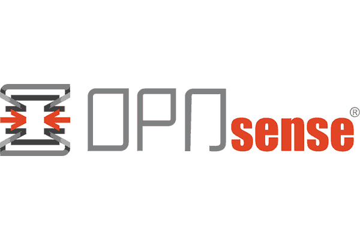

### Overview
Labs are entirely built on virtual machines running on [VMWare Workstation Player 16](https://www.vmware.com/products/workstation-player.html). The tool suite on Kali Linux is used to carry out exploits against vulnerabilities on virtual machines running Windows and older versions of Linux.
### Virtual Machines

<table>
    <tr>
        <th>Logo</th>
        <th>Name</th>
        <th>Description</th>
    </tr>
    <tr>
        <td></td>
        <td><a href="https://opnsense.org/download/">OPNsense</a></td>
        <td>Firewall</td>
    </tr>
    <tr>
        <td></td>
        <td><a href="https://www.kali.org/get-kali/#kali-virtual-machines">Kali Linux</a></td>
        <td>Tool suite for pentesting</td>
    </tr>
    <tr>
        <td></td>
        <td><a href="https://sourceforge.net/projects/metasploitable/">Metasploitable 2</a></td>
        <td>Linux machine with vulnerable web services</td>
    </tr>
     <tr>
        <td></td>
        <td><a href="https://www.microsoft.com/en-us/software-download/windows10">Windows 10</a></td>
        <td>Runs XAMPP and DVWA</td>
    </tr>
</table>

### Network Configuration

* All virtual machines are set to have bridged connections to have their own private IP.
  This is due to some issues in carrying out payloads from exploits that are attempting to connect to the same IP.
* OPNsense is configured for all local traffic to pass through it's firewall.

### Web Applications

* [XAMPP](https://www.apachefriends.org/) - Windows 10 box
* [DVWA](https://github.com/digininja/DVWA) - Windows 10 box

### Pentesting Tools

* Metasploit Framework
* sqlmap
* aircrack-ng
* hashcat
* nmap
* [Burp Suite Community Edition](https://portswigger.net/burp/communitydownload)
* [Rapid7 Vulnerability & Exploit Database](https://www.rapid7.com/db/)
* [Exploit Database](https://www.exploit-db.com/)

### Proxies

* [Burp Suite Community Edition](https://portswigger.net/burp/communitydownload)

### Scripts

* nmap: 
    * [vulscan](https://github.com/scipag/vulscan) for vulnerability scanning.
    * ftp-brute, ftp-anon, and mysql-brute for ftp/SQL login credential enumeration.

### Vulnerabilities

* Cross site scripting
* Backdoor command execution
* Default login credentials/Common passwords
* SQL injections
* Buffer overflows

