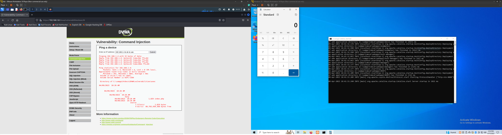
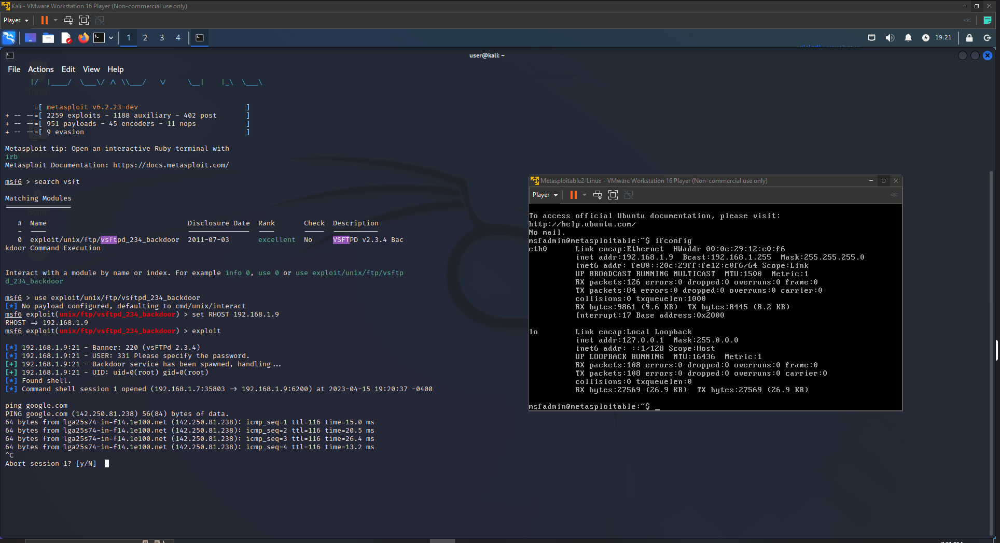

### Overview
Labs are entirely built on virtual machines running on [VMWare Workstation Player 16](https://www.vmware.com/products/workstation-player.html). The tool suite on Kali Linux is used to carry out exploits against vulnerabilities on virtual machines running Windows and older versions of Linux.

### Virtual Machines

* [Windows 10](https://www.microsoft.com/en-us/software-download/windows10)
* [Kali Linux](https://www.kali.org/get-kali/#kali-virtual-machines)
* [Metasploitable 2](https://sourceforge.net/projects/metasploitable/)
* [OPNsense](https://opnsense.org/download/)

### Network Configuration

* All virtual machines are set to have bridged connections to have their own private IP.
  This is due to some issues in carrying out payloads from exploits that are attempting to connect to the same IP.

### Web Applications

* [XAMPP](https://www.apachefriends.org/) - Windows 10 box
* [DVWA](https://github.com/digininja/DVWA) - Windows 10 box

### Pentesting Tools

* Metasploit Framework
* sqlmap
* aircrack-ng

### Reconnaissance Tools

* nmap
* [Rapid7 Vulnerability & Exploit Database](https://www.rapid7.com/db/)
* [Burp Suite Community Edition](https://portswigger.net/burp/communitydownload)

### Proxies

* [Burp Suite Community Edition](https://portswigger.net/burp/communitydownload)

### Scripts

* nmap: 
    * [vulscan for vulnerability scanning.](https://github.com/scipag/vulscan)
    * ftp-brute, ftp-anon, and mysql-brute for ftp/SQL login credential enumeration.

### Vulnerabilities

* Cross site scripting
* Backdoor command execution
* Default login credentials/Common passwords
* SQL injections
* Buffer overflows

